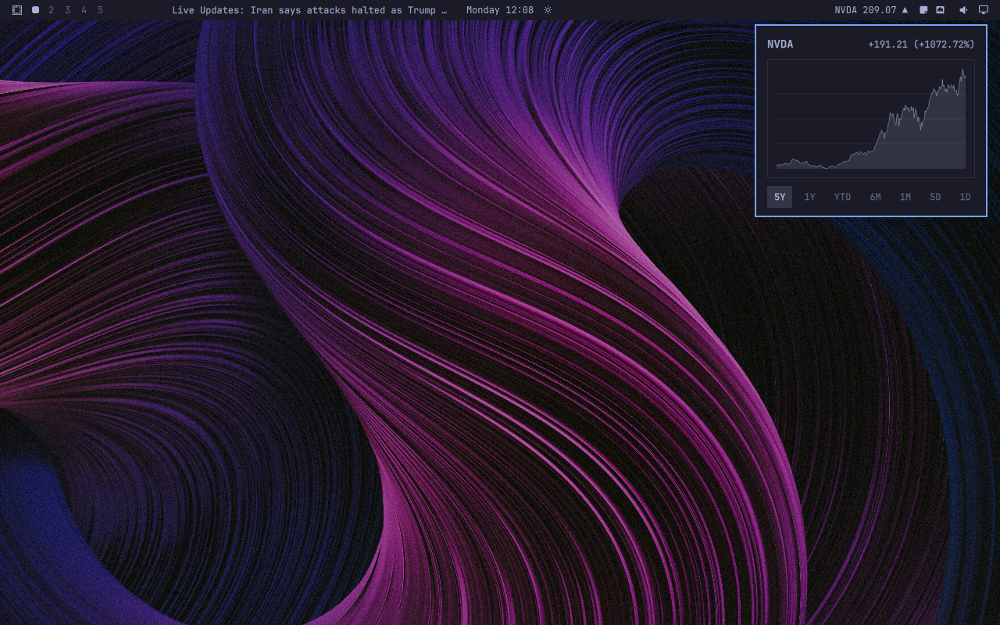

# Omastonk

Omastonk is a multi-instance market widget for the Omarchy bar. It shows a selected symbol, current quote, daily direction, and charts ranging from one day to five years.



## Install

```bash
omarchy plugin add https://github.com/brianblakely/omastonk.git
```

Accept the prompt to enable Omastonk. Omarchy places the first instance in the right bar section by default.

Add another instance with an explicit placement:

```bash
omarchy bar plugin add b.omastonk --section right --duplicate
```

## Usage

Omastonk starts without a symbol. Click it to choose a symbol and open its chart; right-click it to edit the symbol. In the chart, use the arrow keys or `HJKL` to switch intervals and `Escape` to close.

Each instance keeps its own symbol, so multiple widgets can track different markets.

## Network and storage

Omastonk runs `curl` against `query1.finance.yahoo.com`. Quotes refresh every minute and charts load on demand.

Each instance writes its symbol and generated `instanceId` to its own bar-layout entry in `~/.config/omarchy/shell.json`. It does not write other files.

Plugins run unsandboxed inside `omarchy-shell`; review the source before installing it.

## Update

```bash
omarchy plugin update b.omastonk
```

## License

[MIT](LICENSE)
