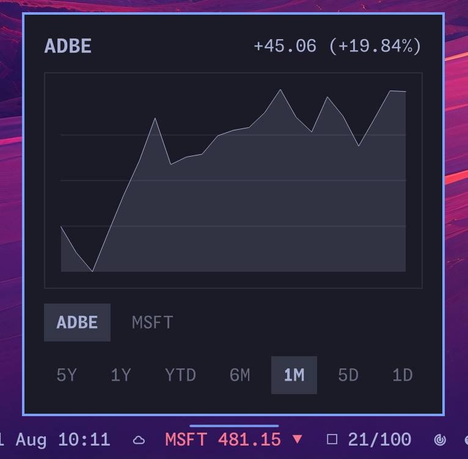

# Omastonk

[](https://github.com/LucaNerlich/omastonk/actions/workflows/ci.yml)
[](https://github.com/LucaNerlich/omastonk/releases)

Omastonk is a multi-symbol market widget for the Omarchy bar. It rotates
through a watchlist of symbols, showing the current quote and daily direction
for each, with a chart panel (one day to five years) per symbol.




Forked from [brianblakely/omastonk](https://github.com/brianblakely/omastonk).

## Install

```bash
omarchy plugin add https://github.com/LucaNerlich/omastonk.git --enable --yes
```

Update to the latest release:

```bash
omarchy plugin update luca.omastonk
```

## Usage

Omastonk starts with an empty watchlist. Right-click it to add symbols; the
bar rotates through them every `rotateSeconds` seconds (default 5). Left-click
the widget to open the chart panel.

In the chart panel:

- Click a symbol tab or press `Up`/`Down` (or `J`/`K`) to switch symbols.
- Click an interval or press `Left`/`Right` (or `H`/`L`) to switch between
  5Y, 1Y, YTD, 6M, 1M, 5D, and 1D.
- Press `Escape` to close.
- Right-click the widget to edit the watchlist: add symbols in the field at
  the bottom (space-separated works too), rename rows inline, and remove
  entries with the `✕` button. Save commits whatever is typed in the add field.

Each widget instance keeps its own watchlist, so multiple instances can track
different markets. Enable extra instances with
`omarchy plugin enable luca.omastonk` (the manifest sets `allowMultiple`).

## Settings

Widget settings live inline on the entry in `~/.config/omarchy/shell.json`:

| Key | Default | Description |
| --- | --- | --- |
| `symbols` | `[]` | Watchlist of market symbols to rotate through, e.g. `AAPL`, `SPY`, `BTC-USD`, `^GSPC`. A legacy single `symbol` string is migrated to this list on first save. |
| `activeSymbol` | first symbol | Symbol shown when the widget loads. |
| `rotateSeconds` | `5` | Seconds each symbol stays on the bar before rotating. `0` disables rotation. |

Quotes are fetched from Yahoo Finance and refreshed roughly once a minute per
symbol, staggered so requests are spread out.

## Architecture

- **Rust backend** (`omastonk-qs`): fetches Yahoo Finance quotes for the whole
  watchlist with staggered round-robin polling and streams JSON lines; also
  serves the panel's chart close-series one request at a time.
- **QML frontend** (`omarchy/`): a `bar-widget` plugin. `BarWidget.qml` runs
  `omastonk-qs watch` once and updates from its JSON lines; `Panel.qml`
  renders charts via `omastonk-qs chart` and owns the watchlist editor. All
  data collection stays in Rust; the QML is pure presentation.

```
omastonk-qs watch ──(JSON lines)──▶ BarWidget ─▶ Panel
omastonk-qs chart ──(JSON line)───▶ Panel
```

The plugin bundles a statically linked x86_64 musl build of its backend
(`omarchy/bin/omastonk-qs`). If the bundled binary cannot start, the widget
falls back to an `omastonk-qs` binary on `PATH` (`cargo install --path .`).

## Development

```bash
make test            # cargo tests
make plugin-test     # node omarchy/model.test.mjs
make clippy          # clippy -D warnings
make fmt             # rustfmt
make validate        # omarchy plugin validate . + qmllint (on an Omarchy machine)
make bundle          # rebuild omarchy/bin/omastonk-qs + hashes
make verify-bundle   # marketplace attestation (reproducible musl rebuild)
```

Any edit under `src/`, `Cargo.toml`, `Cargo.lock`, or `rust-toolchain.toml`
changes the bundled ELF — including comments. Run `make bundle` in the same
change as the Rust edit; do not merge while the **marketplace bundle** CI job
is red.

### Releasing

1. Bump `version` in `Cargo.toml` **and** `manifest.json` (they must match),
   add a `## [X.Y.Z]` section to `CHANGELOG.md`, then run `make bundle`.
2. Open a PR and wait for CI — including the independent **marketplace
   bundle** job — to pass on the merged SHA.
3. Tag the merged commit `vX.Y.Z` and push it. The Release workflow re-runs
   the bundle checks, packages `omastonk-qs-X.Y.Z-linux-x86_64.tar.gz`, and
   publishes the GitHub Release with the changelog section as release notes.

## Uninstall

```bash
omarchy plugin remove luca.omastonk
```

## License

MIT. Original single-symbol widget by Brian Blakely, also MIT.
